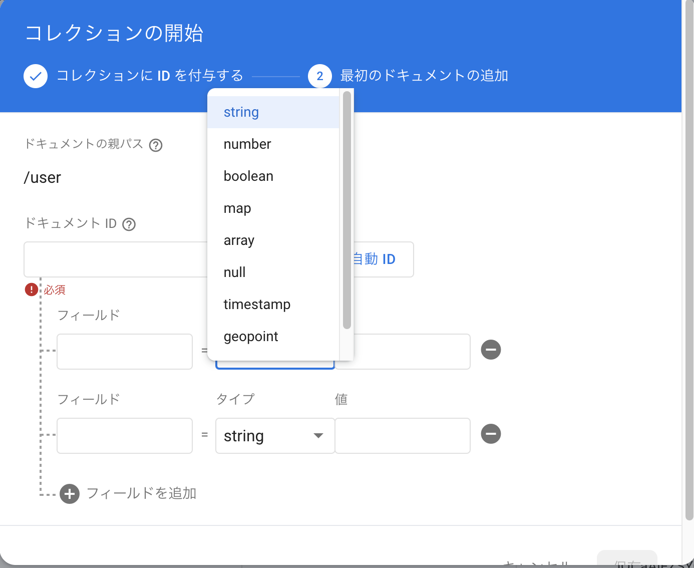
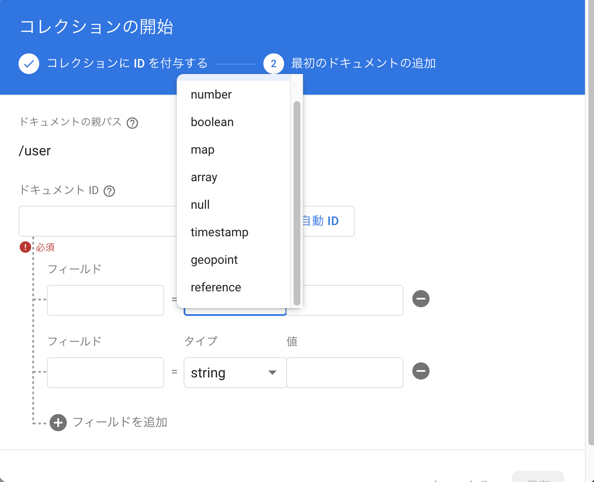
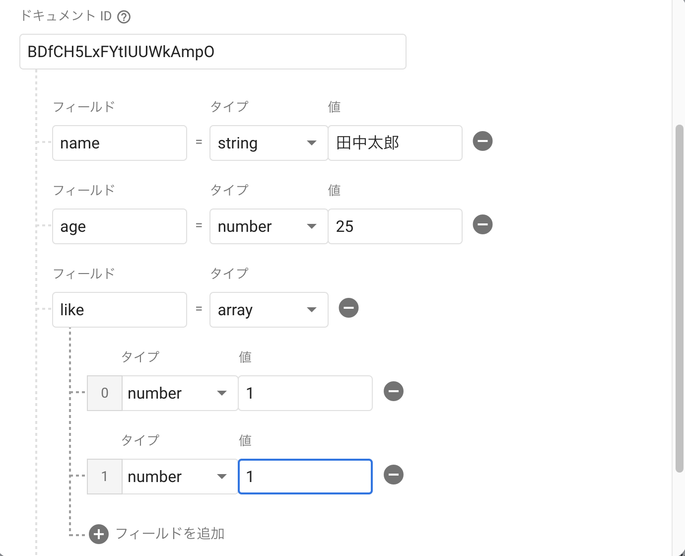
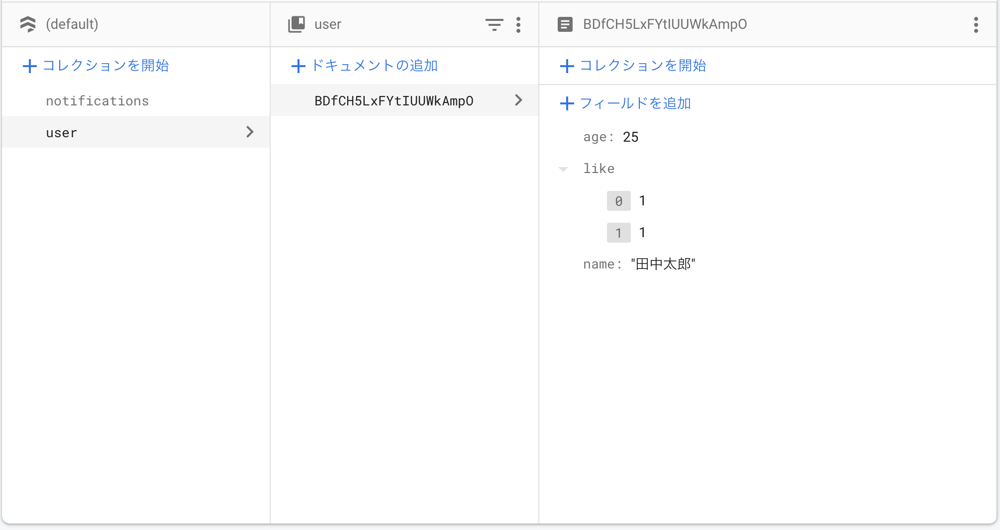
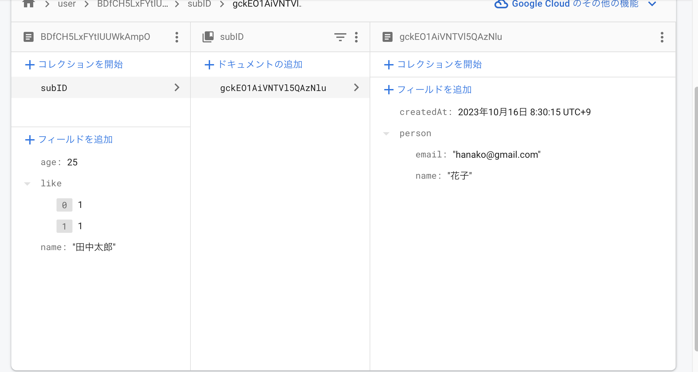

# Firestoreとは?
Firebaseのデータベースサービスの一つで、NoSQLのドキュメント指向データベースです。
ドキュメント指向データベースとは、データをドキュメントと呼ばれる単位で管理するデータベースのことです。
ドキュメントはJSON形式でデータを格納することができます

## ドキュメントとコレクション
Firestoreは、ドキュメントとコレクションという構造体を使ってデータを管理します。

コレクションは複数のドキュメントをまとめて格納できます。
コレクションに対してクエリを実行することで、コレクション内のドキュメントを取得したりソートすることができます。

Firestorの特徴として、ドキュメント自体にもコレクションを持つことができます。ドキュメント配下にもつコレクションのことをサブコレクションと呼びます。

ドキュメントやコレクションのデータのありかは、
/collection/document/subCollection/documentId
のようにパスで表現されます。
collectionやsubCollectionの部分は、コレクションIDやコレクション名、サブコレクション名と呼ばれたりします。

ドキュメントIDは、自動で生成されるランダムな文字列ですが、自分で指定することもできます。
自動生成された場合は、`GopdX3XZ2Z8XZ2Z8XZ2Z`のようなアルファベット大文字小文字と数字からなる２０桁の文字列です。

ファイルシステムに例えると、コレクションはディレクトリ、ドキュメントはファイル、サブコレクションはディレクトリの中にあるディレクトリと考えることができます。

```
📁collection
├📄document
└📁subCollection
  　└📄document
```

Firebase公式のSDKを使用して、パスを指定してデータにアクセスをする仕組みになっています。

[公式のデータ型について](https://firebase.google.com/docs/firestore/manage-data/data-types)

ドキュメントは、１つのデータのオブジェクトを表、複数の`key-value`ペアをフィールドに格納します。

データ型の種類は以下の通りです。
| データ型 | 説明 |
| --- | --- |
| string | 文字列 |
| number | 数値 |
| boolean | 真偽値 |
| array | 配列 |
| map |  key-valueペア |
| null | null値 |
| timestamp | 日付 |
| geoPoint | 緯度経度 |
| reference | 参照 |

ドキュメントはJSONのような構造体のデータオブジェクトとして表現されます。
```json
{
  "name": "John",
  "age": 30,
  "hobbies": ["reading", "cooking"],
  "address": {
    "prefecture": "Tokyo",
    "city": "Shinjuku"
  }
}
```

## Firestoreのスクリーンショット
こんな感じでデータ型を定義します。





**これはコレクションの写真**


**これはサブコレクションの写真**
