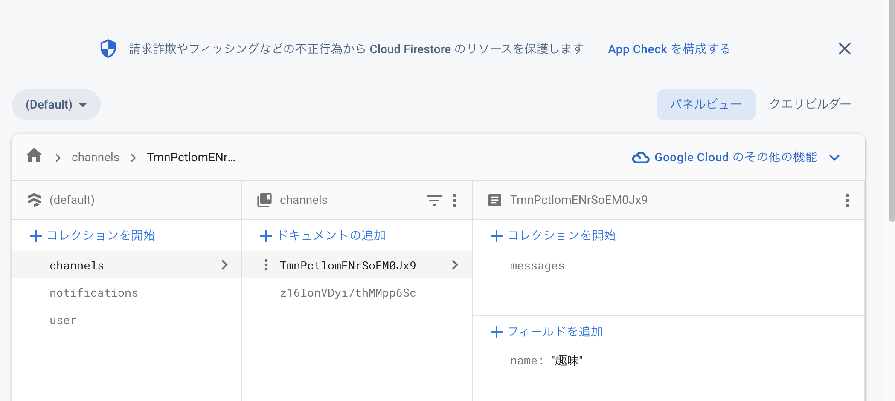

# Firestoreで関係を表現する機能
Firestoreでは、RDBの様にキー項目を使ったサポートはサポートされていません。代わりに３つのデータモデリング機能を使います。

1. 参照型
2. サブコレクション
3. コレクショングループクエリ

🟥 参照型について

Firestoreでは、ドキュメントのフィールドに「参照」というデータ型を持たせることができます。RDBの外部キーと似た役割を果たすことができるようになります。
参照型は、あるドキュメントへのパスの構造を表すデータ型です。

チャットアプリで使うと、「メッセージドキュメント」に投稿者ユーザーの「ユーザードキュメント」への参照を持たせることができます。

autherというフィールドに/users/u1といったドキュメントパスを保存します。これで「メッセージドキュメメント」を読み取れば、その投稿者ユーザーのドキュメントパスも同時に取得できます。必要になったタイミングで、クエリを発行し「ユーザードキュメント」を読み取ることができます。

```dart
final DocumentSnapshot documentSnapshot = await Firestore.instance.collection('messages').document('m1').get();

final Map<String, dynamic> data = documentSnapshot.data;
final DocumentReference authorReference = data['author'];
final DocumentSnapshot authorSnapshot = await authorReference.get();

final Map<String, dynamic> authorData = authorSnapshot.data;
print(authorData['name']);
```

昔こんな記事を書いたので参考にしてみてください。

https://zenn.dev/flutteruniv_dev/articles/fdf4e09c1a143a

RDBの外部キーと似ているが注意点が必要で、参照を用いてもFirestoreのデータベース側で結合できるようになるわけではなく、クライアントサイドジョインが必要です。

クライアントサイドジョインは、Firestoreのデータをクライアント側で結合することを指します。Firestoreのデータベース側で結合することはできません。

Dartで書くと、以下のようになります。

```dart
final QuerySnapshot querySnapshot = await Firestore.instance.collection('messages').getDocuments();

final List<DocumentSnapshot> documentSnapshots = querySnapshot.documents;

final List<Map<String, dynamic>> messages = documentSnapshots.map((DocumentSnapshot documentSnapshot) {
  final Map<String, dynamic> data = documentSnapshot.data;

  final DocumentReference authorReference = data['author'];

  final Map<String, dynamic> authorData = await authorReference.get().then((DocumentSnapshot authorSnapshot) => authorSnapshot.data);

  return <String, dynamic>{
    'id': documentSnapshot.documentID,
    'text': data['text'],
    'author': authorData,
  };
}).toList();

print(messages);
```

これはどんなものだったかというと、別のドキュメントへの参照をシンプルな形で持っているだけということです。

🟥  サブコレクションについて
サブコレクションを使わずに、設計するとこんなデメリットがある。

フィールドを配列(DartだとList)で保存した場合、明細の追加や削除をするたびに配列操作が必要になり、実装が複雑になる。

セキュリティールールで配列の値に対するバリデーションを書くことが困難。

ドキュメントサイズが大きくなり、1度のドキュメント取得の際のオーバーヘッドが大きくなる。
オーバーヘッドとは、データベースからデータを取得する際に発生する通信コストのことです。

ドキュメントサイズが大きくなると、Firestoreのドキュメントサイズの上限の制約にふれてしまういリスクがある。

ドキュメントフィールド上の配列型やMap型は、その中の要素を頻繁に更新したり、セキュリティールールでチェックしようとすると扱いずらくなりがちです。

なるべくクライアントサイドジョインをせずに、サブコレクションをうまく利用するとFirestoreの特性を活かせます。

サブコレクションだと、セキュリティールールを書きやすいというメリットがあります。

過去に書いた記事

[Listを使った保存](https://zenn.dev/flutteruniv_dev/articles/36e422061d9ea4)

[Mapを使った保存](https://zenn.dev/flutteruniv_dev/articles/dfdbdb29940c21)

## コレクショングループクエリについて
同名のサブコレクションを横断してドキュメントを検索できるコレクショングループクエリと呼ばれる機能がある。

私は、サブコレクションを使わなくても作れましたが。。。。

コレクショングループクエリとは、複数のコレクションを横断してクエリを発行することができる機能です。

channelコレクションとmessageコレクションがあるとします。channelコレクションには、チャンネルの情報が保存されていて、messageコレクションには、チャンネルに投稿されたメッセージが保存されています。

channelコレクションとmessageコレクションは、以下のような構造になっているとします。

```js
// channelコレクション
{
  name: 'チャンネル名',
  createdAt: '作成日時',
  updatedAt: '更新日時',
}

// messageコレクション
{
  text: 'メッセージの本文',
  createdAt: '作成日時',
  updatedAt: '更新日時',
}
```

こんな感じでサブコレクションがありますね。別のところにあっても同じコレクション名だったらデータを取得してきます。



過去に書いた記事

[コレクショングループ](https://zenn.dev/flutteruniv_dev/articles/8c0968666fb3c0)